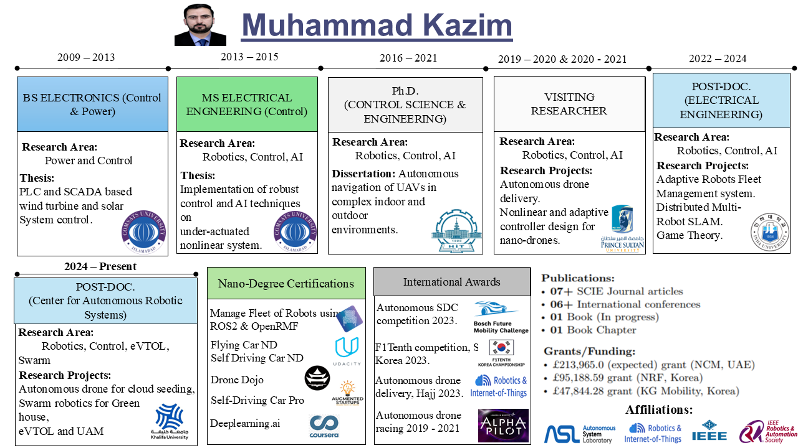

# Welcome 

## About Me

My mission is to research the fundamental challenges of robotics, Control, Optimization, AI, and computer vision that will benefit all of humanity. I am dedicated to advancing the frontiers of technology to create autonomous machines that can navigate all by themselves using only onboard sensors and computations.

## My Research Area

- **Robotics:** Pioneering advancements in autonomous systems.
- **Control Systems:** Innovating control strategies for precision and reliability.
- **Optimization Techniques:** Solving complex problems efficiently.
- **Artificial Intelligence:** Advancing AI for enhanced machine decision-making.
- **Computer Vision:** Developing machines that perceive and understand the world.

## Important Links

Google Scholar: [Google Scholar](https://scholar.google.com/citations?hl=en&user=M_D4PIAAAAAJ&view_op=list_works&sortby=pubdate)

SCOPUS: [SCOPUS](https://www.scopus.com/authid/detail.uri?authorId=57221493698)

ORCID ID: [ORCID ID](https://orcid.org/my-orcid?orcid=0000-0002-4292-0038)

Clarivate Web of Science: [Webofscience](https://www.webofscience.com/wos/author/record/JYT-4895-2024)
## My Robot Fleet

Discover our fleet of cutting-edge robotic platforms:

- **Scout Mini and Scout Hunter Ground Robots:** Versatile ground robots for terrestrial navigation and decision-making.
- **TurtleBot4 and TurtleBot3:** Educational and research robots bridging theory and practice.
- **Delivery Robots:** Autonomous solutions for last-mile delivery and logistics.
- **Crazyflie 2.1 & Autonomous Drones:** Aerial robotics for indoor and outdoor surveillance, disaster response, and beyond.

## Vision

My vision is a future where autonomous machines play a pivotal role in addressing complex challenges and improving the quality of life for people across the globe. I prioritize ethical considerations in AI and robotics, ensuring our technology is developed and deployed responsibly and for the betterment of all.

## Collaborations

I foster collaboration and knowledge-sharing among experts, academia, and industry partners to accelerate progress and ensure the widespread adoption of our innovations.

## Contact Us

Email: dr.kazim110@gmail.com, muhammad.kazim@ku.ac.ae

Phone # +971-58-697-1214

WhatApp # +92-300-044-0584

Khalifa University, Abu Dhabi, UAE

## Partnerships

We are proud to collaborate with leading organizations to drive innovation and make a positive impact on society.

[Partner Logos]

## Follow Us

Stay connected with me:

- [Webpage](https://www.linkedin.com/in/muhammad-kazim-1651b3132/)

